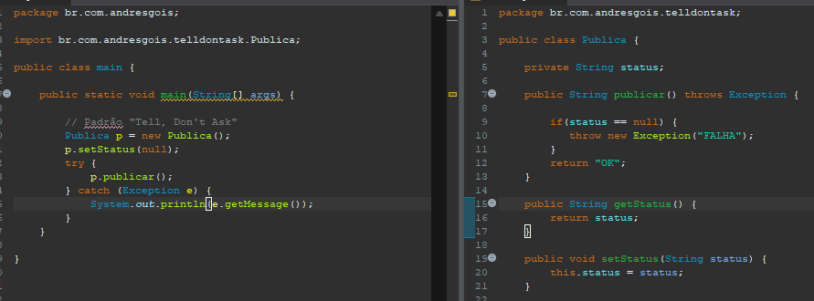

# Padrões de projeto 

## "Tell, Don't Ask"
- O "Tell, Don't Ask" é um dos inúmeros princípios para deixar nosso código mais próximo do que a Orientação a Objetos sugere, e é muito simples de implementar.

- Você nãp pergunta se pode publicar, você publica
- Você começa com o caso de erro.

