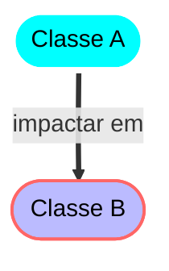
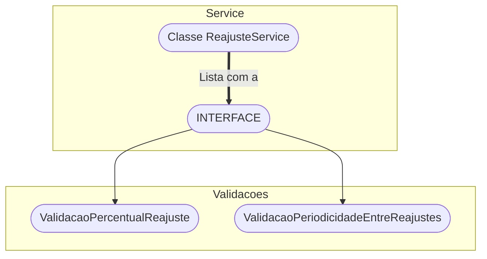
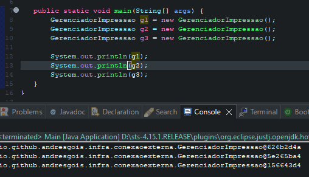
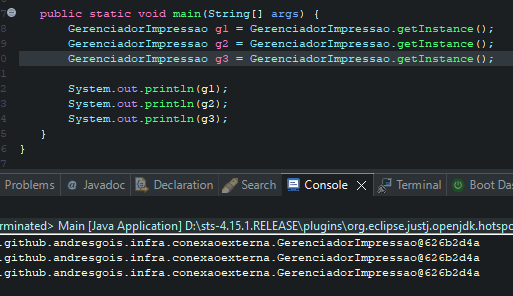

# Padrões de projeto 

## "Tell, Don't Ask"
- O "Tell, Don't Ask" é um dos inúmeros princípios para deixar nosso código mais próximo do que a Orientação a Objetos sugere, e é muito simples de implementar.

- Você nãp pergunta se pode publicar, você publica
- Você começa com o caso de erro.


###  Coesão 
- é "União harmônica entre uma coisa e outra".
- **Exemplo**: temos uma classe funcionario, onde tudo que está dentro representam o que é um funcionário no sistema.
- **Exemplo Negativo**: de *não coesa*, ter um método na classe funcionário que formate o CPF.
- Uma classe coesa faz bem uma única coisa
- Classes coesas não devem ter várias responsabilidades

### Encapsulamento
- incluir e inserir algo em uma cápsula, você proteger alguma coisa independente do que seja essa coisa.
-  classes não encapsuladas, isso faz com que tenhamos violações da regra de negócio do projeto. Podemos ter classes com estados inválidos, com atributos, com valores que não deveriam ter e isso faz com que a classe tenha um aumento no seu acoplamento.
- **Exemplo**: a classe reajustarSalario está dentro da classe funcionario.
- **Exemplo Negativo**: teria um setSalario ou o método reajustarSalario estaria fora da classe funcionário.
- Getters e setters não são formas eficientes de aplicar encapsulamento
- É interessante fornecer acesso apenas ao que é necessário em nossas classes
- O encapsulamento torna o uso das nossas classes mais fácil e intuitivo

### Acoplamento
- É a ação de você acoplar, você fazer um agrupamento aos pares.
- **Exemplo**: do *reajustarSalario* ele deve fica dentro da classe funcionário, caso contrário, teria um alto acoplamento, pois, qualquer alteração levará impacto para outras classes.
- Classes acopladas geram fragilidade
```
public void reajustarSalario(BigDecimal aumento) {
    BigDecimal percentualReajuste = aumento.divide(salario, RoundingMode.HALF_UP);
    if (percentualReajuste.compareTo(new BigDecimal("0.4")) > 0) {
        throw new ValidacaoException("Reajuste nao pode ser superior a 40% do salario!");
    }
    this.salario = this.salario.add(aumento);
    this.dataUltimoReajuste = LocalDate.now();
}
```


- Acoplamento é a dependência entre classes
- Acoplamento nem sempre é ruim, e que é impossível criar um sistema sem nenhum acoplamento
- Devemos controlar o nível de acoplamento na nossa aplicação (falaremos mais sobre isso)


### Single Responsibility Principle
- o princípio da responsabilidade única.
- Que classes/métodos/funções/módulos devem ter uma única responsabilidade bem definida
- uma classe deve ter um e apenas um motivo para ser alterada

### Open Closed 
- que é o princípio do aberto fechado
- A classe reajuste service tem uma lista com os dados que implementam a interface.
- entidades entendam como classes, módulos, funções ou coisas do gênero, elas deveriam estar sempre abertas para a extensão para você adicionar coisas novas, novos comportamentos, porém fechadas para modificação.


- Que cada classe deve conhecer e ser responsável por suas próprias regras de negócio;
- Que o princípio Aberto/Fechado (OCP) diz que um sistema deve ser aberto para a extensão, mas fechado para a modificação
    - Isso significa que devemos poder criar novas funcionalidades e estender o sistema sem precisar modificar muitas classes já existentes
- Uma classe que tende a crescer "para sempre" é uma forte candidata a sofrer alguma espécie de refatoração.

### Princípio de Liskov: Liskov Substitution Principle
- Se parece com pato, se faz 'quack' igual um pato, mas precisa de baterias, então não é um pato, você está usando uma abstração errada
- Se q(x) ' – , a função q(x) – ' é uma propriedade demonstrável dos objetos x do tipo T, então q(y) ' - que é um outro objeto – ' deve ser verdadeiro para objetos Y do tipo S, se S for um subtipo de T"
- Que, embora a herança favoreça o reaproveitamento de código, ela pode trazer efeitos colaterais quando não utilizada da maneira correta;
- Que o Princípio de Substituição de Liskov (LSP) diz que devemos poder substituir classes base por suas classes derivadas em qualquer lugar, sem problema.

## Design Pattern
> Nome
- Da uma ideia do problema que ele resolve
> Problema
- Problema em só
> Solução
- descrição técnica do desing pattern, quais classes envolvidas, propriedades etc..
> Consequência
- Benefícios e malefícios

#### Tipos de padrões descritos pelo GOF
> Padrão de criação
- Padrões que abstraem o processo de instanciação
    - Ex: factory
> Padrão estrutural
- Compõem classes e objetos em estrutura maiores.
> Padrão comportamental
- Definem responsabilidades entre objetos e classes.

#### Exemplo de padrões
> Criação
- Abstract factory
- Factory method
- Singleton
- Builder
> Estrutural
- Adapter
- Decorator
- Facade
- MVC
> Comportamento
- State
- Strategy


### SINGLETON
> Problema que resolve
- Não permite que existe mais de uma instância de um objeto solta em nosso projeto.
    - Conexão com o banco de dados
- Exemplo caso ruim
    - Cada instância está em um lugar diferente na memória



- Muda o formato de instanciação



- Aplicação do Singleton


### Factory method
> É usando quando você não quer especificar qual método deve ser utilizado, funciona através de interfaces


